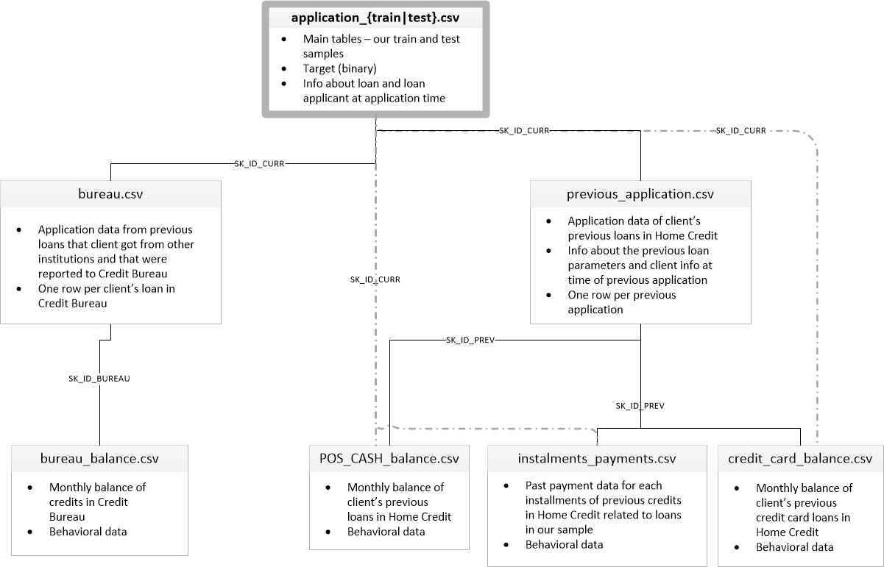

# ocp7_scoring_model_cloud

## Presentation 

This is an OpenClassrooms Data Science project: "deploy a credit scoring in the cloud". The purpose of the project is to create a credit scoring machine learning model, to monitor it using MLOps techniques, then to create a dashboard to visualize the results. 

## Data comes from "Home Credit Default Risk" Kaggle Dataset

https://www.kaggle.com/c/home-credit-default-risk/overview



The data is provided by Home Credit, a service dedicated to provided lines of credit (loans) to the unbanked population. Predicting whether or not a client will repay a loan or have difficulty is a critical business need, and Home Credit is hosting this competition on Kaggle to see what sort of models the machine learning community can develop to help them in this task.

There are 7 different sources of data:

- application_train/application_test: the main training and testing data with information about each loan application at Home Credit. Every loan has its own row and is identified by the feature SK_ID_CURR. The training application data comes with the TARGET indicating 0: the loan was repaid or 1: the loan was not repaid.
- bureau: data concerning client's previous credits from other financial institutions. Each previous credit has its own row in bureau, but one loan in the application data can have multiple previous credits.
- bureau_balance: monthly data about the previous credits in bureau. Each row is one month of a previous credit, and a single previous credit can have multiple rows, one for each month of the credit length.
- previous_application: previous applications for loans at Home Credit of clients who have loans in the application data. Each current loan in the application data can have multiple previous loans. Each previous application has one row and is identified by the feature SK_ID_PREV.
- POS_CASH_BALANCE: monthly data about previous point of sale or cash loans clients have had with Home Credit. Each row is one month of a previous point of sale or cash loan, and a single previous loan can have many rows.
- credit_card_balance: monthly data about previous credit cards clients have had with Home Credit. Each row is one month of a credit card balance, and a single credit card can have many rows.
- installments_payment: payment history for previous loans at Home Credit. There is one row for every made payment and one row for every missed payment.

## Useful links

https://www.kaggle.com/code/willkoehrsen/start-here-a-gentle-introduction/notebook

## Overview

This is your new Kedro project with Kedro-Viz and PySpark setup, which was generated using `kedro 0.19.3`.

Take a look at the [Kedro documentation](https://docs.kedro.org) to get started.

## Rules and guidelines

In order to get the best out of the template:

* Don't remove any lines from the `.gitignore` file we provide
* Make sure your results can be reproduced by following a [data engineering convention](https://docs.kedro.org/en/stable/faq/faq.html#what-is-data-engineering-convention)
* Don't commit data to your repository
* Don't commit any credentials or your local configuration to your repository. Keep all your credentials and local configuration in `conf/local/`

## How to install dependencies

Declare any dependencies in `requirements.txt` for `pip` installation.

To install them, run:

```
pip install -r requirements.txt
```

## How to run your Kedro pipeline

You can run your Kedro project with:

```
kedro run
```

## How to test your Kedro project

Have a look at the files `src/tests/test_run.py` and `src/tests/pipelines/test_data_science.py` for instructions on how to write your tests. Run the tests as follows:

```
pytest
```

To configure the coverage threshold, look at the `.coveragerc` file.

## Project dependencies

To see and update the dependency requirements for your project use `requirements.txt`. Install the project requirements with `pip install -r requirements.txt`.

[Further information about project dependencies](https://docs.kedro.org/en/stable/kedro_project_setup/dependencies.html#project-specific-dependencies)

## How to work with Kedro and notebooks

> Note: Using `kedro jupyter` or `kedro ipython` to run your notebook provides these variables in scope: `catalog`, `context`, `pipelines` and `session`.
>
> Jupyter, JupyterLab, and IPython are already included in the project requirements by default, so once you have run `pip install -r requirements.txt` you will not need to take any extra steps before you use them.

### Jupyter
To use Jupyter notebooks in your Kedro project, you need to install Jupyter:

```
pip install jupyter
```

After installing Jupyter, you can start a local notebook server:

```
kedro jupyter notebook
```

### JupyterLab
To use JupyterLab, you need to install it:

```
pip install jupyterlab
```

You can also start JupyterLab:

```
kedro jupyter lab
```

### IPython
And if you want to run an IPython session:

```
kedro ipython
```

### How to ignore notebook output cells in `git`
To automatically strip out all output cell contents before committing to `git`, you can use tools like [`nbstripout`](https://github.com/kynan/nbstripout). For example, you can add a hook in `.git/config` with `nbstripout --install`. This will run `nbstripout` before anything is committed to `git`.

> *Note:* Your output cells will be retained locally.

## Package your Kedro project

[Further information about building project documentation and packaging your project](https://docs.kedro.org/en/stable/tutorial/package_a_project.html)
